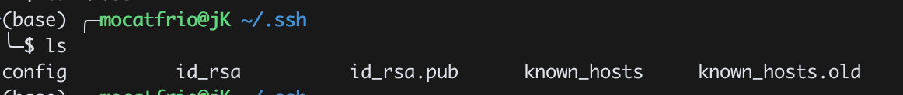
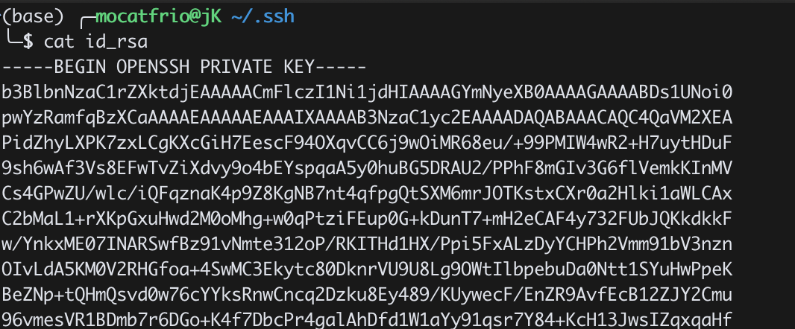

# 🔐 Belajar Mandiri: RSA & SSH Authentication 

Belajar mandiri **kriptografi asimetris RSA (Rivest-Shamir-Adleman)**  dan implementasinya dalam **SSH (Secure Shell)** untuk autentikasi aman tanpa password.

## Tujuan Pembelajaran

- Memahami dasar kriptografi RSA (public key & private key)
- Menjelaskan cara kerja autentikasi SSH dengan RSA
- Mempraktikkan penggunaan SSH key login tanpa password
- Membuat server virtual dengan Docker dan mengaktifkan SSH

## Tools

- Docker
- Python

---

## 🧠 Bagian 1: Pemahaman RSA (Non-Koding)

### Simulasi RSA Manual

Coba hitung dan pahami langkah-langkah berikut:

```
p = 11, q = 13
n = p * q = 143
φ(n) = (p - 1)(q - 1) = 120
Pilih e = 7 (relatif prima dengan 120)
Cari d = 103 (karena 7 * 103 mod 120 = 1)

Pesan: m = 9
Enkripsi: c = m^e mod n = 9^7 mod 143
Dekripsi: m = c^d mod n = ? (harus dapat 9)
```
[Algoritma RSA](RSA.py)

```python
import random
from math import floor
from math import sqrt

RANDOM_START = 1e3
RANDOM_END = 1e5

def is_prime(num):
    if num < 2:
        return False
    if num == 2:
        return True
    if num % 2 == 0:
        return False
    for i in range(3, floor(sqrt(num))):
        if num % i == 0:
            return False
    return True

def gcd(a, b):
    while b != 0:
        a, b = b, a % b
    return a

def modular_inverse(a, b):
    if a == 0:
        return b, 0, 1
    div, x1, y1 = modular_inverse(b % a, a)
    x = y1 - (b // a) * x1
    y = x1
    return div, x, y

def generate_large_prime(start=RANDOM_START, end=RANDOM_END):
    num = random.randint(start, end)
    while not is_prime(num):
        num = random.randint(start, end)
    return num

def generate_rsa_keys():
    p = generate_large_prime()
    q = generate_large_prime()
    n = p * q
    phi = (p-1)*(q-1)
    e = random.randrange(1, phi)
    while gcd(e, phi) != 1:
        e = random.randrange(1, phi)

    d = modular_inverse(e, phi)[1]

    return (d, n), (e, n)

def encrypt(public_key, plain_text):
    e, n = public_key

    cipher_text = []

    for char in plain_text:
        a = ord(char)
        cipher_text.append(pow(a, e, n))

    return cipher_text

def decrypt(private_key, cipher_text):
    d, n = private_key
    plain_text = ''
    for num in cipher_text:
        a = pow(num, d, n)
        plain_text = plain_text + str(chr(a))
    return plain_text


if __name__ == '__main__':
    private_key, public_key = generate_rsa_keys()
    message = 'This is an example message with RSA algorithm!'
    print("Original message: %s" % message)
    cipher = encrypt(public_key, message)
    print("Cipher text: %s" % cipher)
    plain = decrypt(private_key, cipher)
    print("Decrypted text: %s" % plain)
```

---

## 🔐 Bagian 2: RSA & SSH – Apa Hubungannya?

### SSH menggunakan RSA untuk:

- Autentikasi: pengguna membuktikan identitas dengan **private key**
- Tanpa kirim password
- Server cocokkan dengan **public key** yang sudah disimpan

### Proses:

1. Client punya key pair RSA (`id_rsa`, `id_rsa.pub`)
   




2. Public key dikirim ke server (`authorized_keys`)
2. Saat login:
   - Server kirim permintaan → client tanda tangani pakai private key
   - Server verifikasi pakai public key
3. Jika cocok → client bisa login

---

## 🧪 Bagian 3: Hands-On SSH Server dengan Docker

### 1. Buat Folder Proyek

```bash
mkdir ssh-server-docker
cd ssh-server-docker
```

### 2. Buat `Dockerfile`

```Dockerfile
FROM ubuntu:20.04

ENV DEBIAN_FRONTEND=noninteractive

RUN apt update && \
    apt install -y openssh-server sudo && \
    mkdir /var/run/sshd

RUN useradd -ms /bin/bash student && \
    echo "student:student" | chpasswd && \
    echo "student ALL=(ALL) NOPASSWD:ALL" >> /etc/sudoers

RUN mkdir /home/student/.ssh && \
    chmod 700 /home/student/.ssh && \
    chown student:student /home/student/.ssh

EXPOSE 22
CMD ["/usr/sbin/sshd", "-D"]
```

### 3. Build Docker Image

```bash
docker build -t ssh-server .
```

### 4. Jalankan Container

```bash
docker run -d --name ssh-demo -p 2222:22 ssh-server
```

---

## 🔑 Bagian 4: Setup RSA Key

### 5. Generate SSH Key Pair

```bash
ssh-keygen -t rsa -b 2048 -C "student@localhost"
```

### 6. Masukkan Public Key ke Server Docker

```bash
docker exec -i ssh-demo bash -c 'cat >> /home/student/.ssh/authorized_keys' < ~/.ssh/id_rsa.pub
docker exec ssh-demo chown student:student /home/student/.ssh/authorized_keys
docker exec ssh-demo chmod 600 /home/student/.ssh/authorized_keys
```

---

### ✅ 7. Uji Login SSH

```bash
ssh -p 2222 student@localhost
```

> Harus bisa login **tanpa password**

---

### 🔒 8. Nonaktifkan Password Login (Opsional)

```bash
docker exec ssh-demo sed -i 's/^#*PasswordAuthentication yes/PasswordAuthentication no/' /etc/ssh/sshd_config
docker exec ssh-demo service ssh restart
```

---

## 📄 Refleksi & Latihan

### 📝 Tugas Tambahan:

- Manfaatkan AI untuk memperbaiki error. Pahami kodenya, pahami errornya
- Ubah container agar hanya menerima RSA key (password disabled)
- Tambahkan user lain dan bandingkan proses login
- Dokumentasikan seluruh proses (dengan screenshot)

### ❓ Pertanyaan:

1. Apa keuntungan RSA key dibanding password?
2. Mengapa private key harus dirahasiakan?
3. Bagaimana kriptografi RSA bekerja dalam proses login SSH?
4. Apa risiko jika file `id_rsa` bocor?

